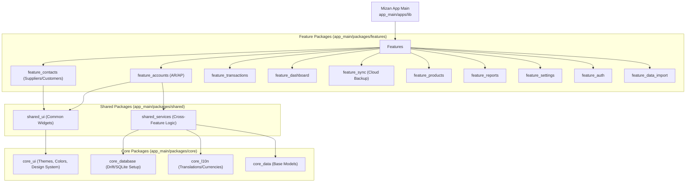

# Mizan App Architecture & Developer Map

This file serves as a comprehensive map of the Mizan monorepo to help developers and AI assistants navigate the codebase efficiently without scanning every folder.

## High-Level Architecture Graph

## Directory Breakdown

### 1. `app_main/apps/`
* **Purpose:** The main Flutter application entry point. 
* **Key Files:** `lib/main.dart` handles the main routing, bottom navigation bar, and tab structure. It glues all the independent feature packages together.

### 2. `app_main/packages/features/`
Independent feature modules. They should rarely depend on each other directly. If they need to communicate (e.g., Accounts needing to read Contacts), they should do so via `shared_services` or shared data models.
* **`feature_accounts`**: Handles Accounts Receivable (AR) and Accounts Payable (AP), ledgers, and invoice tracking.
* **`feature_contacts`**: Handles Customers and Suppliers.
* **`feature_sync`**: Handles Google Drive/Cloud syncing of the SQLite database.

### 3. `app_main/packages/shared/`
Code that is shared across multiple features.
* **`shared_ui`**: Generic components like custom DataTables, specific dialogs, or dropdowns used by multiple features.
* **`shared_services`**: Business logic or state management that spans multiple features.

### 4. `app_main/packages/core/`
The foundational layer of the app. It does not know about any specific feature.
* **`core_database`**: The SQLite (Drift) schema and database connection setup.
* **`core_ui`**: The pure design system (Colors, Typography, Themes).
* **`core_l10n`**: Localization and currency formatting logic.

## Core Flows
* **Database Access**: Features access the database via repositories provided by `core_database`. 
* **Currencies**: Currencies are handled dynamically using `core_l10n` and the Dart `intl` package. Hardcoded currency symbols (like `$`) should be avoided.
* **UI/UX Guidelines**: Mizan aims for a premium, highly responsive UI. Avoid generic widgets. Use responsive tables (`SingleChildScrollView` with horizontal scrolling) and dynamic bottom sheets/dropdowns.
