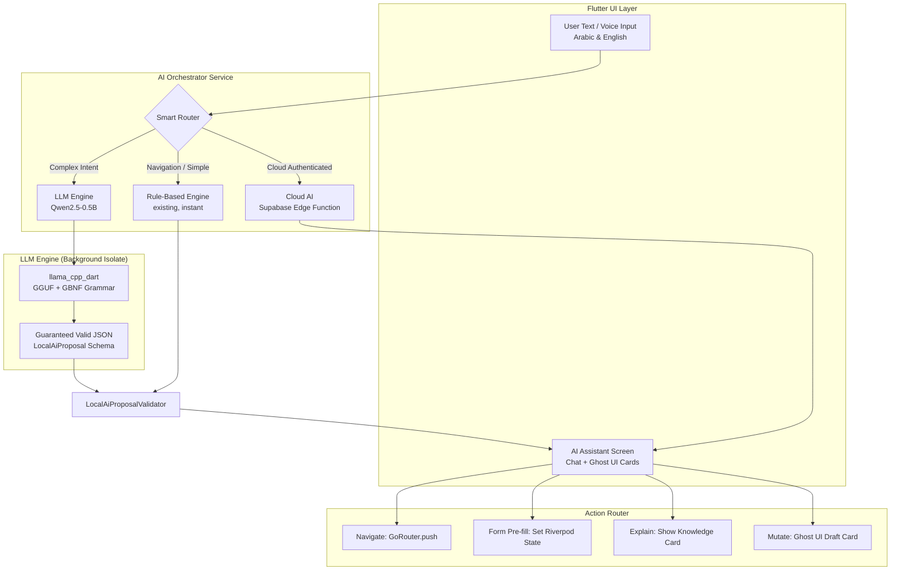

# On-Device AI Assistant Integration for Mizan ERP

## Problem & Goal

Mizan is a complex Arabic+English ERP/Accounting system with 103+ screens covering invoicing, bills, suppliers, customers, journal entries, procurement, inventory, reconciliation, and more. Many users — especially small-business staff — struggle with the system's complexity.

**Goal**: Integrate a fully on-device AI assistant that can guide users through every workflow in the app, pre-fill forms on their behalf, and execute actions with explicit human confirmation (HITL). The AI must run **entirely offline** on the user's phone with **no cloud API dependency** for inference.

---

## User Review Required

> [!IMPORTANT]
> **Model Choice**: This plan recommends **Qwen2.5-0.5B-Instruct** as the primary model. It is the only sub-1B model with production-grade Arabic support (151K vocabulary with native Arabic morphology). However, it is a 390 MB download. An alternative is a two-tier approach where ultra-low-end devices use only the existing rule-based engine.

> [!IMPORTANT]
> **Distribution Strategy**: The AI model (~390 MB) must NOT be bundled in the APK. It will be downloaded on first "Enable Smart Assistant" action. Please confirm this is acceptable for your user base, or if you'd prefer a bundled model.

> [!WARNING]
> **Existing Cloud AI Path**: The current `AiAgentRepository` calls a Supabase Edge Function (`mizan-ai-agent`). This plan does NOT replace that — it adds a **parallel on-device path** that works offline and in guest/local mode. The cloud path remains the premium path for authenticated tenants. The on-device model handles navigation, explanation, and form pre-filling locally.

## Open Questions

> [!IMPORTANT]
> 1. **Model download hosting**: Where should the ~390 MB GGUF model file be hosted for user download? Options: (a) Your own CDN/server, (b) Supabase Storage bucket, (c) GitHub Releases, (d) Google Cloud Storage.
> 2. **Fine-tuning data**: Are you willing to invest in creating ~2,000-5,000 synthetic Arabic+English intent-action training pairs (from the existing JSONL dataset pattern) to fine-tune Qwen2.5 into a specialized "Mizan-SLM"? This would boost accuracy from ~85% to ~98%.
> 3. **iOS support priority**: `llama_cpp_dart` supports iOS via Metal GPU. Should the initial implementation target Android-only or both Android+iOS?
> 4. **Voice input**: Should the assistant accept voice input (Arabic/English speech-to-text)?

---

## Current State Analysis

### What Already Exists (Strong Foundation)

The codebase already has a well-designed AI architecture in [`feature_ai`](file:///d:/mizan_monorepo/app_main/packages/features/feature_ai):

| Component | File | Purpose |
|---|---|---|
| **Engine Interface** | [`local_ai_engine.dart`](file:///d:/mizan_monorepo/app_main/packages/features/feature_ai/lib/src/local_ai/local_ai_engine.dart) | Abstract `LocalAiEngine` interface with `propose()` contract |
| **Proposal Schema** | [`local_ai_proposal.dart`](file:///d:/mizan_monorepo/app_main/packages/features/feature_ai/lib/src/local_ai/local_ai_proposal.dart) | `LocalAiProposal` with intents (explain, propose_mutation, request_missing_info, unsupported), 10 action types, entity extraction |
| **Validator** | [`local_ai_validator.dart`](file:///d:/mizan_monorepo/app_main/packages/features/feature_ai/lib/src/local_ai/local_ai_validator.dart) | 435-line business rule validator: party updates, document updates, balance adjustments, journal entries, archive/void — with Arabic digit normalization |
| **Rule-Based Engine** | [`rule_based_local_ai_engine.dart`](file:///d:/mizan_monorepo/app_main/packages/features/feature_ai/lib/src/local_ai/rule_based_local_ai_engine.dart) | 566-line deterministic keyword matcher for Arabic+English — already handles customer/vendor/invoice/bill/journal/archive/void intents |
| **Native Bridge** | [`local_ai_native_bridge.dart`](file:///d:/mizan_monorepo/app_main/packages/features/feature_ai/lib/src/local_ai/local_ai_native_bridge.dart) | `LocalAiNativeInferenceBridge` interface, `MethodChannel` implementation, `NativeTfliteLocalAiEngine` adapter, `LocalAiModelManifest` with SHA-256 checksums |
| **Cloud AI Repo** | [`ai_agent_repository.dart`](file:///d:/mizan_monorepo/app_main/packages/features/feature_ai/lib/src/data/ai_agent_repository.dart) | Full Supabase Edge Function integration with action drafts, confirmation tokens, HITL flow |
| **UI** | [`ai_assistant_screen.dart`](file:///d:/mizan_monorepo/app_main/packages/features/feature_ai/lib/src/presentation/ai_assistant_screen.dart) | Chat UI with message bubbles, draft composer, action cards with confirm/cancel |
| **Test Fixtures** | [`local_ai_synthetic_dataset.jsonl`](file:///d:/mizan_monorepo/app_main/packages/features/feature_ai/test/fixtures/local_ai_synthetic_dataset.jsonl) | 19 Arabic+English training/validation/edge samples |

### What's Missing (This Plan Fills)

1. **Real LLM engine** — the `localAiEngineProvider` currently defaults to `DisabledLocalAiEngine`
2. **llama.cpp integration** — replace the TFLite-only `NativeTfliteLocalAiEngine` with a GGUF-based `llama_cpp_dart` engine
3. **GBNF grammar** — constrained decoding to guarantee valid `LocalAiProposal` JSON
4. **Navigation intents** — the current proposal schema lacks `navigate` and `open_screen` action types
5. **Knowledge base** — embedded workflow documentation for the model's RAG context
6. **Model download + management UI** — download, verify, store, update the GGUF file
7. **Orchestrator** — smart routing between rule-based (instant), on-device LLM, and cloud AI
8. **Expanded action types** — navigation, screen guidance, workflow explanation

---

## Recommended Model & Framework

### Model: Qwen2.5-0.5B-Instruct (Q4_K_M quantization)

| Criterion | Value |
|---|---|
| Parameters | 500M |
| Quantized size | **~390 MB** (GGUF Q4_K_M) |
| RAM during inference | **~650–850 MB** |
| Arabic quality | **Excellent** — 151K vocab with native Arabic morphology, ~1.3 tokens/Arabic word |
| English quality | Strong for intent extraction and structured output |
| Mobile speed | **35–55 tok/s** on mid-range Snapdragon 680/695 |
| Fits 3-4GB RAM? | ✅ Yes, with safe headroom |
| Function calling | ⭐⭐⭐⭐ with GBNF grammar — near 100% valid JSON |
| License | **Apache 2.0** — free for commercial use, no MAU limits |

### Why Not Others?

| Model | Rejection Reason |
|---|---|
| Gemma 3n E2B | ~2 GB RAM, kills Flutter on 3GB phones |
| Gemma 2 2B | ~2.2 GB RAM, no grammar-constrained decoder |
| Phi-4 Mini 3.8B | 3.2 GB RAM minimum, high Arabic token fertility |
| SmolLM2 135M/360M | **Unusable Arabic** — 49K vocab, ~4.2 tok/word, gibberish |
| Llama 3.2 1B | Good but 700M MAU license cap, Arabic needs fine-tuning |
| OpenELM | No Android support, zero Arabic |

### Framework: `llama_cpp_dart` with GBNF Grammars

| Feature | Why It Wins |
|---|---|
| GBNF Constrained Decoding | **100% syntactically valid JSON** — model physically cannot emit invalid tokens |
| Dart FFI | Direct C++ bindings, no JNI overhead, runs in background Dart Isolate |
| Pre-built binaries | Pre-compiled Android AAR (ARM64) and iOS XCFramework (Metal) |
| Hardware acceleration | Vulkan/OpenCL on Android, Metal on iOS |
| GGUF format | Universal, well-maintained, supports all Qwen2.5 quantizations |
| 60 FPS UI | LLM runs in secondary thread, never blocks Flutter rendering |

---

## Architecture



### Three-Tier Routing Logic

```
User Input → Orchestrator Decision:

1. NAVIGATION intents (instant, <5ms):
   "How to add a supplier?" → Rule-based → Navigate to /contacts/new?type=vendor
   "Go to reports"          → Rule-based → Navigate to /reports

2. COMPLEX intents (on-device LLM, 1-3 seconds):
   "Create a bill for supplier X for 5000 SAR" → Qwen2.5 → GBNF → Ghost UI Card
   "What's our depreciation method?"           → Qwen2.5 + RAG → Explanation Card

3. CLOUD intents (authenticated only):
   Existing flow via AiAgentRepository → Supabase Edge Function
```

---

## Proposed Changes

### Core AI Package (`feature_ai`)

---

#### [NEW] `lib/src/local_ai/llm_local_ai_engine.dart`

The primary new engine implementation. Wraps `llama_cpp_dart` to:
- Load the Qwen2.5-0.5B GGUF model from app storage
- Build system prompt with UI context injection and knowledge base
- Apply GBNF grammar for `LocalAiProposal` schema
- Run inference in a background Dart Isolate
- Parse and validate the constrained JSON output
- Report deterministic progress (tokens generated, not spinning)

Key behaviors:
```dart
class LlmLocalAiEngine implements LocalAiEngine {
  // Device RAM probe — selects 0.5B vs 1.5B (or refuses if <3GB)
  // GBNF grammar enforcement — guarantees valid JSON
  // System prompt with:
  //   - Mizan action schema
  //   - Current screen context (page, entity IDs, status)
  //   - Knowledge base excerpts (via local vector search)
  // Background isolate execution — UI never blocks
}
```

#### [NEW] `lib/src/local_ai/gbnf_grammar.dart`

Defines the GBNF (GGML Backus-Naur Form) grammar that constrains Qwen2.5 output to only valid `LocalAiProposal` JSON. This eliminates malformed JSON from small models entirely.

```gbnf
root ::= "{" ws
  "\"schema_version\":" ws "\"mizan.local-ai.proposal/v1\"" "," ws
  "\"intent\":" ws Intent "," ws
  "\"action_type\":" ws ActionType "," ws
  "\"fields\":" ws Object "," ws
  "\"entities\":" ws "[]" "," ws
  "\"missing_fields\":" ws StringArray "," ws
  "\"confidence\":" ws Number "," ws
  "\"requires_confirmation\":" ws Boolean "," ws
  "\"locale\":" ws Locale "," ws
  "\"source\":" ws "\"local\""
  ws "}"

Intent ::= "\"explain\"" | "\"propose_mutation\"" | "\"request_missing_information\"" | "\"unsupported\""
ActionType ::= "\"none\"" | "\"unsupported\"" | "\"navigate\"" | "\"customer_update\"" | ...
```

#### [NEW] `lib/src/local_ai/ai_orchestrator.dart`

Smart router that decides which engine to use:
```dart
class AiOrchestrator {
  // 1. Check if input matches navigation keywords → rule-based (instant)
  // 2. Check if LLM engine is available → llm engine (1-3s)
  // 3. Check if cloud mode + authenticated → cloud AI
  // 4. Fallback to rule-based engine
}
```

#### [NEW] `lib/src/local_ai/model_download_service.dart`

Handles downloading the ~390 MB GGUF model:
- Downloads from CDN with resume support (HTTP Range headers)
- SHA-256 checksum verification
- Stores in `ApplicationDocumentsDirectory`
- Reports **deterministic download progress** (bytes downloaded / total bytes) — no indeterminate spinners
- Handles storage space checks before download

#### [NEW] `lib/src/local_ai/knowledge_base.dart`

Embeds Mizan workflow documentation as a local knowledge base:
- Pre-embedded workflow guides for all major features
- Simple TF-IDF or cosine similarity search (no heavy vector DB)
- Returns top-3 relevant knowledge chunks for system prompt injection

#### [NEW] `lib/src/local_ai/navigation_action_types.dart`

Extends `LocalAiActionTypes` with navigation actions:
```dart
static const navigate = 'navigate';
static const openScreen = 'open_screen';
static const searchEntity = 'search_entity';
```

Maps all ~103 screens to route paths and keywords (Arabic + English).

---

#### [MODIFY] [`local_ai_engine.dart`](file:///d:/mizan_monorepo/app_main/packages/features/feature_ai/lib/src/local_ai/local_ai_engine.dart)

- Update `localAiEngineProvider` to probe device capability and select the appropriate engine tier (rule-based, LLM, or disabled)
- Add `LocalAiRequest.screenContext` field for UI state injection

#### [MODIFY] [`local_ai_proposal.dart`](file:///d:/mizan_monorepo/app_main/packages/features/feature_ai/lib/src/local_ai/local_ai_proposal.dart)

- Add `navigate`, `open_screen`, `search_entity` to `LocalAiActionTypes`
- Add `explanation` field for explain-intent responses
- Add `route` field for navigation proposals

#### [MODIFY] [`local_ai_native_bridge.dart`](file:///d:/mizan_monorepo/app_main/packages/features/feature_ai/lib/src/local_ai/local_ai_native_bridge.dart)

- Update `LocalAiModelManifest` to support `gguf` format (currently validates `.tflite` only)
- Add `llama_cpp` as accepted quantization type alongside existing TFLite types

#### [MODIFY] [`ai_assistant_screen.dart`](file:///d:/mizan_monorepo/app_main/packages/features/feature_ai/lib/src/presentation/ai_assistant_screen.dart)

- Add local AI mode — works in guest/offline mode (currently blocked behind `cloudDataModeProvider`)
- Add typing indicator with token-count progress (deterministic, not indeterminate spinner)
- Add navigation action handling — when AI says "navigate", actually push the route
- Add knowledge cards for explanation responses
- Add model download prompt on first use
- Apply premium micro-interactions per AGENTS.md guidelines

#### [MODIFY] [`feature_ai.dart`](file:///d:/mizan_monorepo/app_main/packages/features/feature_ai/lib/feature_ai.dart)

- Export new files: `llm_local_ai_engine.dart`, `ai_orchestrator.dart`, `model_download_service.dart`, `navigation_action_types.dart`

---

### New Package: `feature_ai` dependency addition

#### [MODIFY] [`feature_ai/pubspec.yaml`](file:///d:/mizan_monorepo/app_main/packages/features/feature_ai/pubspec.yaml)

Add dependencies:
```yaml
dependencies:
  llama_cpp_dart: ^0.4.0     # On-device LLM inference via llama.cpp FFI
  path_provider: ^2.1.0       # ApplicationDocumentsDirectory for model storage
  crypto: ^3.0.0               # SHA-256 checksum verification
  http: ^1.2.0                 # Model download with resume support
```

---

### Model Distribution & Knowledge Base

#### [NEW] `assets/ai/mizan_knowledge_base.json`

Pre-compiled knowledge base containing:
- Navigation map (screen name → route → Arabic/English keywords)
- Workflow guides for every major feature (how to create invoice, add supplier, post journal, etc.)
- Accounting glossary (Arabic + English)
- Common error resolutions

#### [NEW] `assets/ai/model_manifest.json`

Model manifest for download verification:
```json
{
  "model_id": "qwen2.5-0.5b-instruct",
  "model_version": "1.0.0",
  "artifact_name": "qwen2.5-0.5b-instruct-q4_k_m.gguf",
  "sha256": "<computed-at-build-time>",
  "download_url": "<cdn-url>",
  "size_bytes": 409600000,
  "supported_locales": ["ar", "en"],
  "minimum_app_version": "1.1.0",
  "task": "proposal_extraction",
  "quantization": "q4_k_m"
}
```

---

### Localization

#### [MODIFY] [`app_en.arb`](file:///d:/mizan_monorepo/app_main/packages/core/core_l10n/lib/src/app_en.arb)
#### [MODIFY] [`app_ar.arb`](file:///d:/mizan_monorepo/app_main/packages/core/core_l10n/lib/src/app_ar.arb)

New keys for:
- `aiSmartAssistantEnable` / `تفعيل المساعد الذكي`
- `aiModelDownloading` / `جاري تحميل نموذج الذكاء`
- `aiModelDownloadProgress` / `تم تحميل {downloaded} من {total}`
- `aiModelReady` / `المساعد جاهز`
- `aiNavigatingTo` / `يتم الانتقال إلى {screen}`
- `aiLocalMode` / `يعمل المساعد بدون اتصال`

---

## Phased Delivery

### Phase 1: Navigational Copilot (Week 1-2)
- Integrate `llama_cpp_dart` package
- Implement `LlmLocalAiEngine` with GBNF grammar
- Add navigation action types and route mapping for all 103 screens
- Model download service with deterministic progress
- Enable AI assistant in guest/offline mode
- "How do I add a supplier?" → Navigates to supplier form

### Phase 2: Knowledge Expert (Week 3-4)
- Build `mizan_knowledge_base.json` covering all feature workflows
- Implement local TF-IDF knowledge retrieval
- Inject current screen context into system prompt
- "What is a journal entry?" → Shows explanation card with accounting context
- "How do I reconcile my bank?" → Step-by-step guide with "Take Me There" button

### Phase 3: Ghost UI Workflow Executor (Week 5-7)
- Wire LLM proposals to form pre-fill (Riverpod state injection)
- Navigation + pre-fill combo: "Create a bill for supplier X for 5000 SAR" →
  Navigate to `/contacts/bills/new` + pre-fill supplier, amount, currency
- HITL confirmation cards with 5-second undo grace windows
- Expand GBNF grammar for all 15 action types

### Phase 4: Fine-Tuning & Polish (Week 8+)
- Generate 2,000-5,000 synthetic training pairs from existing JSONL pattern
- QLoRA fine-tune Qwen2.5-0.5B into "Mizan-SLM"
- A/B test fine-tuned vs base model on intent accuracy
- Premium micro-interactions per AGENTS.md

---

## Verification Plan

### Automated Tests
```bash
# Existing tests (must not regress)
cd d:\mizan_monorepo\app_main
powershell -Command 'flutter test packages/features/feature_ai/test/'

# New unit tests
# - LLM engine: GBNF grammar produces valid LocalAiProposal JSON
# - Orchestrator: routes to correct engine tier
# - Model manifest: validates GGUF format acceptance
# - Navigation map: all 103 screens have route+keyword mappings
# - Knowledge base: relevant chunks returned for common queries
# - Validator: new action types (navigate, open_screen) pass validation
```

### Manual Verification
- Download and load Qwen2.5-0.5B GGUF on a mid-range Android phone (3-4GB RAM)
- Verify inference speed (target: >30 tok/s)
- Verify Arabic intent extraction: "كيف أضيف مورد جديد؟" → Navigate to supplier form
- Verify English intent extraction: "Create a bill for 5000 SAR" → Ghost UI card
- Verify RAM usage stays under 850 MB during inference
- Verify Flutter UI maintains 60 FPS during LLM generation
- Verify model download with pause/resume
- Verify offline mode works without any network
